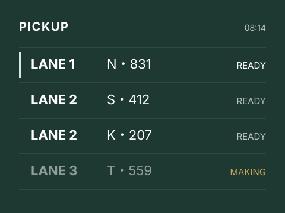

<!-- _class: title -->

<div class="badge">STORE EXPERIENCE 2026</div>

# 店舗体験リニューアル計画

## 「もう一つの居場所」をデジタルでも届ける

### 商品開発部 / 店舗運営部 合同提案

2026-08-08 / 社内提案レビュー

---

<!-- _class: agenda -->

## 本日のアジェンダ

1. いま店舗で起きていること
2. 体験設計の3つの原則
3. モバイルオーダーの改善
4. リワードプログラムの再設計
5. 導入ロードマップと成果指標

---

<!-- _class: section -->

# いま店舗で起きていること

## 数字が示す3つのボトルネック

---

<!-- _class: stats -->

## 直近12か月の実績

<div class="stats-container">

<div class="stat-item">
<div class="stat-number">42%</div>
<div class="stat-label">モバイルオーダー経由の売上比率</div>
</div>

<div class="stat-item">
<div class="stat-number">6.4分</div>
<div class="stat-label">ピーク時間帯の平均受け取り待ち時間</div>
</div>

<div class="stat-item">
<div class="stat-number">-11%</div>
<div class="stat-label">リワード会員の月次アクティブ率</div>
</div>

</div>

---

## 待ち時間が伸びている理由

モバイルオーダーの比率が上がるほど、カウンターは**受け取りだけの行列**で埋まります。

注文の受付能力は増えたのに、受け渡しの導線は以前と同じままです。

つまりボトルネックは注文ではなく、**受け取りの物理的な設計**にあります。

> ピーク時の店内滞在客のうち、38%は受け取り待ちのみで滞留している。

---

<!-- _class: content-2col -->

## カスタマージャーニーの断絶

<div>

### アプリ側で起きていること

- 注文完了までは平均48秒とスムーズ
- 完成予定時刻は表示されている
- 店舗の混雑状況は反映されていない
- 受け取りレーンの案内がない

</div>

<div>

### 店舗側で起きていること

- 完成品の置き場が1カ所に集中
- 呼び出しは口頭アナウンスのみ
- レジ行列と受け取り列が交差する
- パートナーが案内に時間を取られる

</div>

---

<!-- _class: content-center -->

## 解くべき課題は一つ

### 「注文の速さ」ではなく「受け取りの確実さ」を設計する

体験の評価はカップを受け取ったときに決まる

---

<!-- _class: section -->

# 体験設計の3つの原則

## 何を守り、何を変えるか

---

<!-- _class: content-3col -->

## 設計原則

<div>

### 待たせない

完成予定時刻を店舗で計測した混雑データから算出し、アプリ側の表示を**実態に合わせる**。

- 混雑度APIの新設
- 予定時刻の再計算
- 遅延時のプッシュ通知

</div>

<div>

### 迷わせない

受け取りレーンを注文種別ごとに分け、**どこに行けばよいか**を注文完了画面で提示する。

- レーン番号の割り当て
- 店内サイネージ連動
- 受け取り完了のタップ

</div>

<div>

### 忘れさせない

再来店の理由をつくる。スター付与を**受け取り直後**に見せ、次回の動機に接続する。

- 受け取り後の獲得演出
- 次のランクまでの残数
- 期間限定チャレンジ

</div>

---

<!-- _class: content-2col-comparison -->

## 受け取り体験のBefore / After

<div>

### Before(現行)

- 完成品は1カ所のカウンターに集約
- 呼び出しは口頭アナウンスのみ
- 予定時刻は注文数のみから推定
- 受け取り完了の記録が残らない

</div>

<div>

### After(提案)

- 注文種別ごとに3レーンへ分散
- アプリのレーン表示 + サイネージ連動
- 計測した混雑データを加えた予定時刻
- 受け取りタップで完了を記録

</div>

---

<!-- _class: content-steps -->

## 実装の3ステップ

<div class="steps-container">

<div class="step-item">
<div class="step-number">1</div>
<div class="step-content">

### 計測 (1〜2か月)

3店舗にセンサーを設置し、時間帯別の受け取り待ち時間を計測します。現行の予定時刻との乖離を定量化します。

</div>
</div>

<div class="step-item">
<div class="step-number">2</div>
<div class="step-content">

### 試行 (3〜5か月)

レーン分散とアプリのレーン表示を同じ3店舗で先行導入し、待ち時間と満足度の変化を検証します。

</div>
</div>

<div class="step-item">
<div class="step-number">3</div>
<div class="step-content">

### 展開 (6〜12か月)

売上上位200店舗へ順次展開します。店舗レイアウトごとにレーン設計のパターンを用意して適用します。

</div>
</div>

</div>

---

<!-- _class: content-list-panel -->

## 想定されるリスク

<div>

### 注意すべき4点

1. **レーン分散のスペース不足**: 小型店では3レーンを物理的に置けない
2. **パートナーの手順増**: 受け取り記録の操作が新たな負担になる
3. **予定時刻の精度**: 計測データが少ない店舗では従来より悪化する可能性
4. **サイネージの設置コスト**: 全店展開時の初期投資が想定を超えやすい

</div>

<div class="panel">

### 対策の基本方針

**小型店には2レーン構成の縮小版**を用意し、全店で同じ設計を強制しません。

受け取り記録は既存のPOS操作に統合し、新しい端末を増やしません。

</div>

---

<!-- _class: content-grid-2x2 -->

## 先行4店舗の試行結果

<div>

### 都心大型店

待ち時間が6.8分から4.1分へ短縮。3レーン構成が最も効果を発揮した。

</div>

<div>

### 駅構内小型店

2レーン構成で運用。待ち時間の改善は0.9分にとどまるが誤受け取りがゼロに。

</div>

<div>

### 郊外ドライブスルー併設店

店内受け取りとドライブスルーの導線分離により、レジ行列の交差が解消。

</div>

<div>

### オフィスビル内店舗

朝のピークに限定してレーン運用。時間帯限定でも待ち時間が2.2分短縮。

</div>

---

<!-- _class: reward -->

## リワードプログラムの再設計

<div class="badge badge-reward">200★ ITEM</div>

<div class="panel">

### 受け取り直後にスターを見せる

現行はアプリを開き直さないと獲得スターが分かりません。受け取り完了のタップと同時に**獲得スターと次のランクまでの残数**を表示します。

</div>

<div class="box-light">

**ゴールドランクの特典**は据え置きとし、変更するのは「いつ見せるか」だけに絞ります。制度変更は会員の不信を招くため今回の範囲外とします。

</div>

---

<!-- _class: content-image-right -->

## 店内サイネージの表示案

<div>

### 表示する情報は3つだけ

**レーン番号・注文者名の頭文字・完成状態**のみを表示します。

情報を増やすと視認に時間がかかり、行列の解消が遅れます。

- 1画面あたり最大8件
- 完成から90秒でハイライト
- 未受け取りは色を変えて残す

個人名の全表示は行わず、頭文字と注文番号の下3桁で識別します。

</div>

<div>



</div>

---

<!-- _class: content-dark-code -->

## 混雑度APIの応答例

<div>

店舗ごとに計測した待ち時間を返し、アプリ側が完成予定時刻を再計算します。

`lane` は割り当てられた受け取りレーンです。

</div>

<div>

```json
{
  "storeId": "JP-1408",
  "congestion": "high",
  "waitMinutes": 5.2,
  "order": {
    "id": "A-8831",
    "lane": 2,
    "readyAt": "2026-08-08T08:14:00+09:00"
  }
}
```

</div>

---

## 投資対効果の比較

| 施策                    | 初期投資 | 待ち時間改善 | 展開スピード    |
| ----------------------- | -------- | ------------ | --------------- |
| レーン分散のみ          | 低       | 1.2分        | 3か月で200店舗  |
| レーン分散 + アプリ表示 | 中       | 2.4分        | 6か月で200店舗  |
| 上記 + サイネージ       | 高       | 2.7分        | 12か月で200店舗 |

サイネージの追加投資に対する改善幅は0.3分にとどまるため、**まず中位案で展開する**ことを推奨します。

---

<!-- _class: callout -->

## 受け取りの15秒が、次の来店を決める

注文体験の改善余地はすでに小さい。伸ばせるのは受け取りの側です。

<div><span class="cta">中位案で承認をお願いします</span></div>

---

<!-- _class: summary -->

## 提案のまとめ

<div class="summary-items">

<div class="summary-item">

### 課題は受け取り導線

注文は速くなったが受け渡しの設計が追いついていない。ピーク時滞在客の38%が受け取り待ちのみ。

</div>

<div class="summary-item">

### 打ち手はレーン分散

注文種別ごとに受け取りレーンを分け、アプリとサイネージで行き先を明示する。

</div>

<div class="summary-item">

### まず中位案で展開

サイネージは追加改善が小さい。レーン分散とアプリ表示を6か月で200店舗へ。

</div>

</div>

---

<!-- _class: closing -->

# ご清聴ありがとうございました

## 質問・ご指摘をお願いします

**store-experience@example.com**
